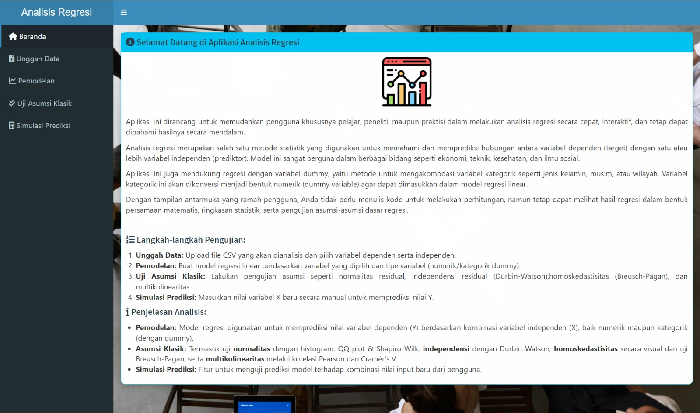

# 📊 Projek Akhir Komputasi Statistik - Analisis Regresi Linear

> **Kelompok 1 - Statistika 2023 B**

---

## ✨ Deskripsi Singkat

Aplikasi web ini dikembangkan menggunakan **R Shiny** sebagai tugas akhir mata kuliah *Komputasi Statistik*.  
Tujuan utama aplikasi adalah memudahkan pengguna  baik mahasiswa, peneliti, maupun praktisi  dalam melakukan **analisis regresi linear** dengan antarmuka interaktif.  

Analisis mencakup:
- Pemodelan regresi linear
- Uji asumsi klasik
- Visualisasi scatterplot
- Fitur prediksi nilai baru

---

## 👥 Anggota Kelompok

| Nama Anggota               | NIM         |
|----------------------------|-------------|
| Bagus Arya Dwipangga       | 1314623042  |
| Rafi King Akbar            | 1314623018  |
| M. Fahri Novarian          | 1314623014  |
| Elvian Eraneo Subroto      | 1314623038  |
| Ariya Zuhdi Ismail         | 1314623065  |
| Bima Aji Saputra           | 1314623012  |

---

## 🚀 Fitur Aplikasi

- ✅ Upload file dataset (.csv)
- ✅ Pemilihan variabel target (Y) dan prediktor (X)
- ✅ Deteksi otomatis variabel numerik dan kategorik (dummy)
- ✅ Pemodelan regresi linear secara interaktif
- ✅ Evaluasi model regresi
- ✅ Uji asumsi klasik:
  - Normalitas (Shapiro-Wilk, Q-Q Plot)
  - Homoskedastisitas (Breusch-Pagan)
  - Multikolinearitas (VIF & korelasi)
  - Autokorelasi (Durbin-Watson)
- ✅ Visualisasi residual
- ✅ Scatter plot *Actual vs Predicted*
- ✅ Prediksi nilai baru berdasarkan input user

---

## 📑 File Presentasi

📂 **Presentasi (PDF)** → [Download di sini](PPT_Komstat_Kel1.pdf)

---

## 🖼️ Tampilan Aplikasi

Berikut contoh tampilan halaman beranda aplikasi:

*Terima kasih sudah mengunjungi repositori kami — semoga bermanfaat! 🚀*
